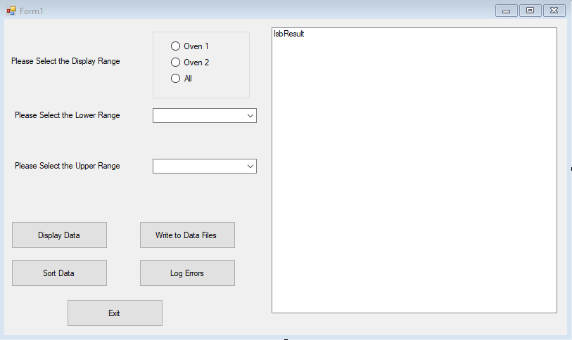
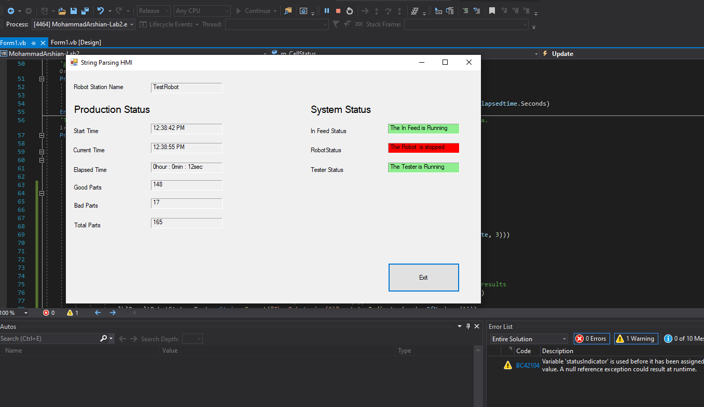
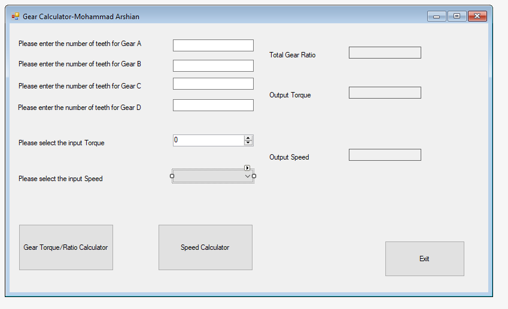
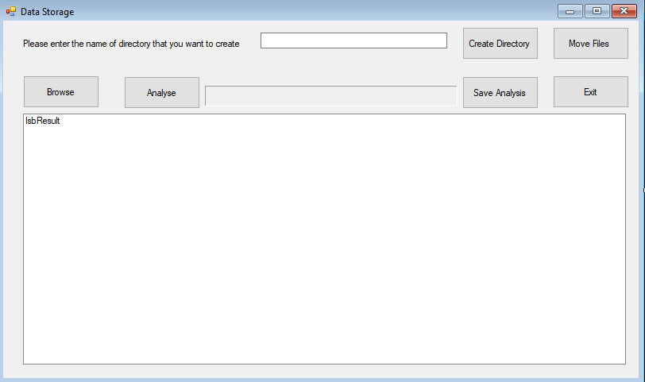

# 2020-Data communication(TCP/IP)-Industrial Screens-VB.Net
<h1 align="center">
   
  
   
  Development Technologies 
   
</h1>

  
  
  
   
  

 
 

  <a href="#Purpose">Purpose</a> •
  <a href="#how-to-use">How It Work</a> •
  <a href="#Screens">Screens</a> •

## Purpose

It aims to improve and learn industrial Screen applications and the Data communication(TCP/IP) protocol used in Industrial settings. 

## How It Work

* VB studio extract files.Replace the folders on a empty project.

> **Note**
>  Keep OBJ & bin.

## Screens

---

> Website(https://) -
> GitHub (https://github.com/Marshi00) - 
> Linkedin (https:)

